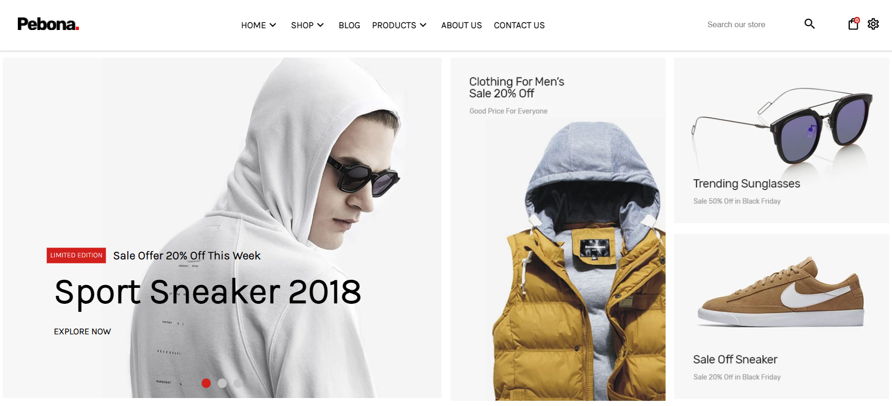

# Pebona
The aim of this exercise is to put into practice the knowledge of HTML5 and CSS to create the layout of a responsive website for a clothing shop called Pebona.

## Result


## Responsive webpage


## Installation
1. Clone this repository
2. Open CMD in the download directory and execute the following npm commands:
```
npm install
```
```
npm run build
```
```
npm start
```
3. Go to http://localhost:3000/ in your web browser

## Concepts developed in this project:
- Develop a reponsive website for desktop and mobile, considering mobile first.
- Use corresponding HTML structural tags for each section.
- Use the box model attributes for adding and modifying the spacing between and the size of the elements.
- Use animations, transformations, opacity and shadows.
- Use flex and grid.
- Use Node.js to build the website ("npm run build" should create and populate the dist directory with minified HTML and CSS files).
